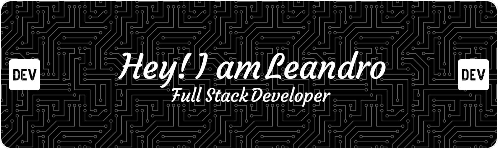

<h1 align="center">Hi 👋, I'm Leandro</h1>
<h3 align="center">A Student of Computer Science and a Junior Full Stack Dev!</h3>

  

  

- 🌱 I’m currently learning **React Native**

- 💬 Ask me about **C#, Angular**

- 📫 How to reach me **leandro.sabreu@outlook.com**

- 📄 Know about my experiences [https://www.linkedin.com/in/leandro-dos-santos-de-abreu/](https://www.linkedin.com/in/leandro-dos-santos-de-abreu/)

- ⚡ Fun fact **My favorite hobbies are TTRPG and Games**

<h3 align="left">Connect with me:</h3>

<h3 align="left">Languages and Tools:</h3>

                         

&nbsp;

